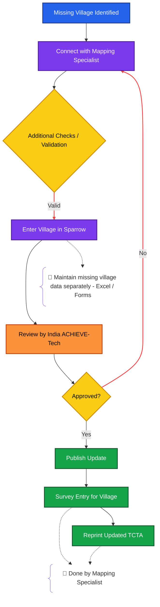

---
tags:
  - Mapping_Specialist
  - Reporting
  - Sparrow
  - ACHIEVE
  - COTW
  - Tool
---

 

# Process Flow

> [!note]
> Additional **Checks / Validation** referenced in the flow above are detailed in  
> [[3. how to enter CP Track#📍 Location Verification Guidelines]].
>
> The **Mapping Specialist must complete these checks** before marking any village as missing.