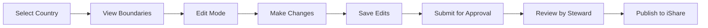

   
   
  
  ## 1. Understanding the ==Boundary Administration Tool a.k.a Sparrow==??

**Sparrow** is a **map-based administrative tool** that allows users to:

- View geographical boundaries (Admin 3: Village Parent Boundaries)
    
- Add, move, or delete villages
    
- Track changes to boundaries
    
- Submit updates for approval before publishing
    

  

> [!note]
> It acts as a **controlled editing layer** between raw geographic data and what is officially used in iShare.

---

## 2. Why is it used?

## **Core Purpose**

- Maintain **accurate geographic data**
    
- Enable **structured boundary updates**
    
- Prevent **unauthorized or unverified changes**
    
- Provide **auditability (change history)**
    

  

## **Problems it solves**

|**Problem**|**How Sparrow solves it**|
|---|---|
|Inconsistent village boundaries|Centralized editing via map|
|Lack of control over changes|Approval workflow|
|No history of edits|Change tracking system|
|Manual / scattered updates|Unified platform|

---

## 3. How the Tool Works (Conceptual Flow)

---

## 4. How to Use Sparrow (Step-by-Step)

---

## **🔐 Step 1: Login & Select Country**

- After login → Map view appears
    
- Select a **country** (only permitted ones visible)
    

---

![[Sparrowv2.CountryMap.png]]

---

## **🗺️ Step 2: View Boundaries**

- Displays **Village Parent Boundaries (Admin 3)**
    
- Click a boundary → detailed view opens
    

  

Includes:

- Map of villages
    
- List of villages (left panel)
    
- Status badge
    

---

![[Sparrowv2.Adm3Villages.png]]

---

## **🔄 Step 3: Understand Status Workflow**

|**Status**|**Meaning**|
|---|---|
|**Published**|Live in iShare|
|**In Progress**|Being edited|
|**Pending Approval**|Awaiting review|
|**Ready to Publish**|Approved, waiting to go live|

> [!important]
> You **cannot edit** boundaries in _Pending Approval_ or _Ready to Publish_ states.

---

## **✏️ Step 4: Enter Edit Mode**

- Toggle **“Edit Mode” ON**
    
- Locks navigation to current boundary
    

---

## **➕ Step 5: Add a Village**

- Click on map
    
- Fill details in popup
    
- Save
    

  

Effects:

- Village added to list
    
- Boundary auto-adjusted
    

---

![[Sparrowv2.AddVillage.png]]

---

## **🔀 Step 6: Modify Village**

  

### **Move:**

- Click **move icon**
    
- Select new location on map
    
- Exit move mode
    

  

### **Delete:**

- Edit village → click **Delete**
    

|**Action**|**Badge**|
|---|---|
|Added|🟢 Green|
|Modified|🔵 Blue|
|Removed|🔴 Red|

---

## **💾 Step 7: Save Changes**

- Click **“Save Edits”**
    
- Status → **In Progress**
    

---

![[Sparrowv2.SaveEdits.png]]

---

## **🚪 Step 8: Exit Edit Mode**

- System prompts to save changes
    

---

![[Sparrowv2.ExitEditMode.png]]

---

## **📜 Step 9: View Change History**

- Navigate to **Change History**
    
- Shows:
    
    - All modified boundaries
        
    - Change sets
        
    - Who made changes
        
    - When changes were made
        
    

---

![[Sparrowv2.ChangeHistory.png]]

![[Sparrowv2.Changeset.png]]

---

## **✅ Step 10: Submit for Approval**

- Click **Submit for Approval**
    
- Add comments/instructions
    

---

![[Sparrowv2.SubmitForApproval.png]]

---

## **👨‍⚖️ Step 11: Approval Process**

  

### **Roles:**

|**Role**|**Permissions**|
|---|---|
|**Boundary Editor**|Create & edit changes|
|**Boundary Steward**|Approve / reject changes|

### **Outcomes:**

- ✅ Accept → Ready to Publish
    
- ❌ Reject → Back to In Progress
    

---

![[Sparrowv2.PendingApproval.png]]

---

# 5. Key Benefits

  

> [!success]

> Sparrow introduces **structure, control, and traceability** into boundary management.

  

### **Major Advantages:**

- 🗺️ Visual map-based editing
    
- 🔄 Controlled workflow (Edit → Approve → Publish)
    
- 📜 Full audit trail (Change History)
    
- 👥 Role-based access control
    
- 📍 Automatic boundary adjustments
    
- 🔍 Search & filtering capabilities
    

---

## 6. Common Problems ⚠️ / Hurdles

  

## **🔴 1. Limited Access**

- Only permitted countries editable
    
- Role restrictions apply
    

---

## **🔴 2. Edit Mode Constraints**

- Cannot switch boundaries while editing
    
- Must exit properly
    

---

## **🔴 3. Manual Publishing**

- Final publish step is **not automated yet** 
    

---

## **🔴 4. Workflow Bottlenecks**

- Approval depends on **Boundary Steward**
    
- Can delay deployment
    

---

## **🔴 5. Learning Curve**

- Requires understanding:
    
    - Map interactions
        
    - Status lifecycle
        
    - Change sets
        
    

---

## **🔴 6. Tool Still Evolving**

- Features may change (early release) 
    

---

## 7. Key Concepts You Must Understand 🧠 **

  

> [!tip]

> If you understand these, you understand Sparrow.

  

- **Admin 3 Boundary** → Parent region containing villages
    
- **Edit Mode** → Required to make any changes
    
- **Change Set** → Group of saved edits
    
- **Status Lifecycle** → Controls workflow
    
- **Approval System** → Ensures data integrity
    

---

## 8. Final Summary (TL;DR)

  

> [!abstract]
> **Sparrow is a controlled GIS editing tool for managing village boundaries with a structured approval workflow.**

  

- It allows **map-based editing of villages**
    
- Ensures **data accuracy via approval system**
    
- Tracks **every change made**
    
- Prevents **unauthorized updates**
    