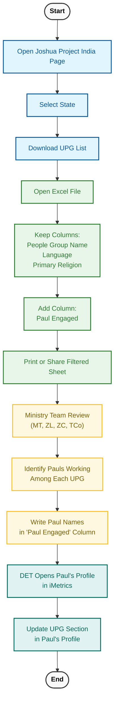

---
tags:
  - ACHIEVE
  - DET
  - iMetrics
  - Mapping_Specialist
  - Reporting
  - TTI
---

> [!IMPORTANT]
> This guide explains how to:
>
> - Collect **Unreached People Group (UPG)** data  
> - Prepare the dataset for Ministry Team review  
> - Enter UPG information into **iMetrics**  
> - Handle common issues during the process  
>
> A **basic understanding of UPGs** is required before using this guide.  
> Please read the Reporting Terms document for background information.

---

## Overview of the Workflow

The UPG reporting process involves four main stages:

1. Download UPG data from **Joshua Project**  
2. Prepare the dataset by filtering the required columns  
3. Identify Pauls engaged with UPGs through **Ministry Team review**  
4. Update UPG information in **iMetrics**  

---

## 1. How to Collect UPG Data

### Phase 1 — Data Extraction (Joshua Project)

1. Go to the **Joshua Project – India page**  
   [joshuaproject.net/countries/IN](https://joshuaproject.net/countries/IN)  
2. Select the **state** from the dropdown  
3. Scroll down and click **Download List**  

---

### Phase 2 — Data Preparation (Excel Filtering)

1. Open the downloaded **Excel file**  
2. Keep only the following columns:

   | Column | Field              |
   |--------|--------------------|
   | F      | People Group Name  |
   | I      | Language           |
   | K      | Primary Religion   |

3. Delete all other columns  
4. Add a new column named **Paul Engaged**

   This column will be used to record the **Pauls currently working among the respective UPGs**.

   The final dataset should look like this:

   | People Group Name | Language | Primary Religion | Paul Engaged |
   |-------------------|----------|------------------|--------------|

---

### Phase 3 — Ministry Team Identification

1. Print the filtered sheet *(a soft copy can also be used)*  
2. Share the sheet with the **Ministry Team**, which includes:

   - MT  
   - ZL  
   - ZC  
   - TCo  

3. The Ministry Team identifies **Pauls currently working among the UPGs**

> [!INFO]
> - A **Paul can serve multiple UPGs**  
> - **Multiple Pauls can serve one UPG**  
> - If a Paul is working among a UPG, their **name should be written in the "Paul Engaged" column**  

---

## 2. How to Enter UPG Data in iMetrics

Once the Ministry Team has identified the engaged Pauls:

### Step 1 — Select the Paul

1. Select the correct **Country & TC Group** and the **Paul whose UPG data needs to be entered or updated**

   

2. Select the correct **Training Center**

   

3. Ensure that you are in the correct **Training Center**, then go to the **"Unreached People Groups Impacted"** section and click **Add**

   

---

### Step 2 — Enter the UPG

1. Select the **UPG** from the dropdown  

   

2. Click **Save**

---

## 3. Process Diagram

---

## 4. Common Errors and Troubleshooting

### 1. UPG Not Found in the Joshua Project List

Sometimes a Paul may report working among a people group that does not appear in the downloaded Joshua Project dataset.

> [!CHECK]
> Provide the name of the UPG to the **Reporting Manager**, who will verify and update the system if required.

---

### 2. UPG Name Does Not Match the iMetrics Dropdown

Sometimes the UPG name from Joshua Project may not match the dropdown options in iMetrics.

> [!CHECK]
> The **Data Entry Team (DET)** should inform the **Reporting Manager**, who will reconcile the difference.

---

## 5. Key Principles for UPG Reporting

### Purpose of UPG Identification

The goal of identifying UPGs is not merely to fill out a section for every Paul. Instead, the objective is to determine whether we have Pauls who:

- **Are working among a UPG**  
- **Have believers, Timothys, or relatives from a UPG**  
- **Have adopted a UPG**  

This information helps leadership understand where active ministry engagement with UPGs is happening.

---

### UPG Identification Is an Ongoing Process

- UPG identification is **not a one-time activity** (e.g., TOT1)  
- It is a **continuous process**, and updates should be made in iMetrics whenever new information becomes available  

---

## 6. Displaced People Groups

You may notice a **"Displaced People Groups"** checkbox when assigning UPGs to a Paul in iMetrics.  
This section explains what it means and when it should be used.

### What Are Displaced People Groups?

**Displaced People Groups** are people groups that originate from a specific geographic region but are currently living in another country due to migration.

This migration may occur for several reasons, including:

- Seeking better economic opportunities  
- Conflict or persecution  
- Refugee movement  
- Other social or political factors  

### When Does This Situation Occur?

Sometimes a Paul may be working among a **Displaced People Group** rather than among people living in their original homeland.

When the Data Entry Team (DET) receives this information and attempts to select the UPG from the dropdown in iMetrics, the people group may **not appear in the list**.

---

### What Should DET Do?

In this case:

1. Select the **"Displaced People Groups"** checkbox  
2. Once selected, the **People Group field will automatically populate with the appropriate Displaced People Group**

> [!TIP]
> Use the **Displaced People Groups** checkbox only when the UPG does not appear in the dropdown because the people group is living outside its original geographic location.
