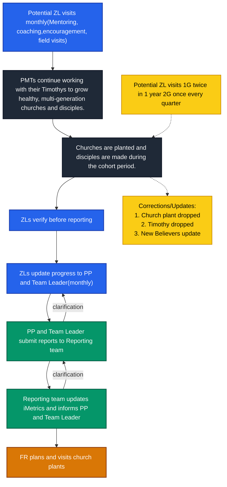

---
tags:
  - TTI
  - Reporting
  - iMetrics
  - DET
  - Mapping_Specialist
  - ACHIEVE
date: 2026-03-25
---

> [!abstract]
> This guide explains how to enter Post-Graduate Church Plant reports (for potential Master Trainers) into iMetrics.

## Process

> [!note] Important Guidelines for Field Visits
>  - Field Representative (FR) visits are planned and conducted independently as part of the regular reporting process, while maintaining coordination with ministry team.
>  - Zonal Leaders (ZLs) are welcome to accompany FRs during visits.  
>  - FRs must share their visit plans or schedules in advance with the Zonal Coordinator (ZC), Zonal Leader (ZL), and Point Person (PP) to ensure alignment and smooth coordination.  
>  - All teams are expected to extend full cooperation during FR visits to support effective verification and reporting.  
>  - Zonal Leaders and Point Persons must ensure that:
> 	 - All newly planted churches are communicated to the Reporting Team in a timely manner.  
> 	 - Every reported church plant is visited by a Field Representative.
> 
> This ensures data accuracy and prevents integrity-related issues toward the end of the cohort.

---

### 1. ==Collection==

- Collect all forms submitted by Pauls.
- Ensure forms are reviewed by:
  - Master Trainers (MTs), or  
  - Zonal Leaders (ZLs), where MTs are not present  

> [!important] **Important**  ⚠️ 
> 
> Ministry leaders (MTs/ZLs) should be aware of what is being reported to ensure alignment and transparency.

#### Notes:
- It is **not mandatory** for MTs or ZLs to have personally visited a Church Plant.
- A Church Plant can be reported if:
  - The Paul has verified it, after it was planted by their Timothy.

---

### 2. ==Verification==

Before entering data into iMetrics, all forms must be carefully verified.

#### ✅ Verification Checklist

- [ ] Timothy names match existing records in iMetrics  
- [ ] Village name matches official records in iShare  
- [ ] Block and District mapping is correct  
- [ ] Baptisms are not greater than New Believers  
- [ ] 2nd Generation Church includes the Titus name  
- [ ] Date format is consistent and valid  

#### 📍 Location Verification Guidelines

- A village name written by a Paul may differ from its **official name** in iShare.
- A Paul may incorrectly mention the **block (Level 3)** due to limited awareness.
- The village may actually belong to a **different block or district**.

> [!Warning]
> Do not immediately mark such cases as "Missing Village".  
> Perform due diligence before proceeding to:  [[2. Add a missing village|How to add a Missing Village]]

#### ⚠️ Error Handling

If any inconsistency is found:
- Always go back to the **Paul**
- Keep **MTs, ZLs, and ZCs** informed
- Clarify and correct the data before proceeding

> [!tip] **Rule of Thumb**  
> When in doubt, **clarify before proceeding**. ✅ 

---

### 3. ==Data Entry==

> [!danger]
> Data entry should only begin **after verification is complete**.

#### Step 1: Navigate to Church Section

- Go to the **Paul’s Profile**
- Open the **"Churches"** section
- Click **"Add Church"**

**Alternative:**
- Click the **"+" icon** next to a Timothy’s name under  
  **"Timothies and Churches"**
- This pre-fills the Timothy name in the "**New Church**" form

| ![[niranjaniMetrics.png]] | ![[NirtimiMetrics.png]] | 
| - | -

---

#### Step 2: "New Church" Form

- You will see the **"New Church"** form

![[NEwiMetrics.png]]

---

#### Step 3: Select Church Type

- **1st Generation Church (Planted by Timothy):**
  - Select **"Choose an existing Church Planter"**
  - Choose the Timothy from the dropdown  

- **2nd Generation Church (Planted by Titus):**
  - Select **"Choose a Church Planter Mentor"**
  - Choose the Timothy  
  - Enter the Titus name in **"Enter New Church Planter Name"**

| ![[NEwiUMetrics.png]] | ![[NewChurchi.png]] | 
| - | -

---

#### Step 4: ==Description (Optional)==

- This field is optional  
- For **Post-Graduate batches (India only)**:
  - Add: `"Post-Graduate Church Plant"`

![[desNewChurchi.png]]

> [!tip] This helps in identifying such records later.

---

#### Step 5: ==Enter Date==

- Enter the date in the correct format  
- This should already be verified in the previous stage  

---

#### Step 6: ==Estimated Size==

- Enter the number of people attending the church  
- Minimum allowed value: **3**

> [!tip] Refer to [[Reporting Terms]] for the definition of a Church.

---

#### Step 7: ==Add Location==

This is a **critical field** for tracking the ACHIEVE movement. Hence it is really important to not skip the verification stage. 

- Click **"Select a Location"**
- ![[locaiiMetrics.png]]
- In the popup **"Choose a Church Location"**:

  **Option 1:**  
  - Search using the village name  

  **Option 2:**  
  - Navigate through levels:
    - Level 1: State  
    - Level 2: District  
    - Level 3: Block  
    - Level 4: Village  

  **Option 3:**  
  - Select directly from the map  

> [!danger]
> It is very important to check the **survey status** of the village before entering a Church Plant record.  
>
> - If the village is **unsurveyed (White)**, **do not proceed** with adding the location.  
> - Ask the Paul or Ministry Team to provide the required survey data.  
> - Only continue with data entry once the village has been surveyed.  
>
> ### How to Check Survey Status
> - Refer to the GIF below to visually confirm the survey status  
> - Check within the **TCTA** of the Paul  
> - Verify through **iShare**

- ![[addloc.gif]]
- ![[finaliMetrics.png]]
- Click **"Save Location"**

---

#### Step 8: ==Save Record==

- Click **"Create Church"**
- ![[CreaChur.png]]

---

#### Step 9: ==Confirmation==

- The new Church record will appear under:
  - **Paul’s Profile → Churches Tab**
  - ![[paulProCh.png]]

---

## Key Takeaways

- Always **verify before entering data**
- Maintain **consistency in names and locations**
- Ensure **leadership visibility (MT/ZL/ZC)**
- When unsure, **clarify — do not assume**