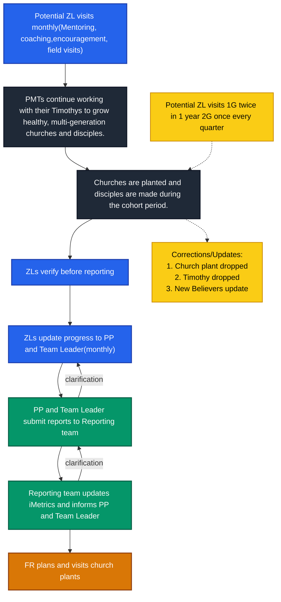
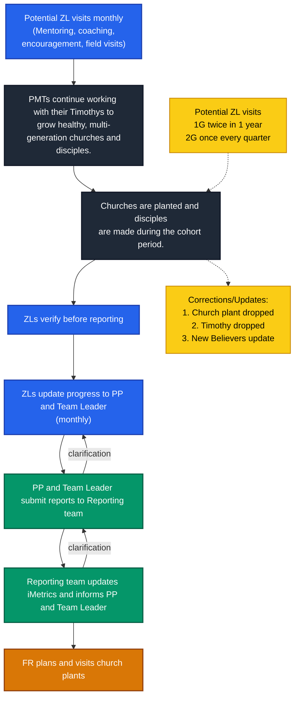

---
tags:
  - TTI
  - Reporting
  - iMetrics
  - DET
  - Mapping_Specialist
  - ACHIEVE
date: 2026-03-25
---

> [!abstract]
> This guide explains how to enter Post-Graduate Church Plant reports (for potential Master Trainers) into iMetrics.

## Process

 

> [!note] Important Guidelines for Field Visits
>  - Field Representative (FR) visits are planned and conducted independently as part of the regular reporting process, while maintaining coordination with ministry team.
>  - Zonal Leaders (ZLs) are welcome to accompany FRs during visits.  
>  - FRs must share their visit plans or schedules in advance with the Zonal Coordinator (ZC), Zonal Leader (ZL), and Point Person (PP) to ensure alignment and smooth coordination.  
>  - All teams are expected to extend full cooperation during FR visits to support effective verification and reporting.  
>  - Zonal Leaders and Point Persons must ensure that:
> 	 - All newly planted churches are communicated to the Reporting Team in a timely manner.  
> 	 - Every reported church plant is visited by a Field Representative.
> 
> This ensures data accuracy and prevents integrity-related issues toward the end of the cohort.

---

 

mermaid chart

---

### 1. ==Collection==

---

### 2. ==Verification==

---

### 3. ==Data Entry==

---

#### Step 2: "New Church" Form

---

#### Step 3: Select Church Type

---

#### Step 4: ==Description (Optional)==

---

#### Step 5: ==Enter Date==

---

#### Step 6: ==Estimated Size==

---

#### Step 7: ==Add Location==

---

#### Step 8: ==Save Record==

---

#### Step 9: ==Confirmation==

---

## Key Takeaways

